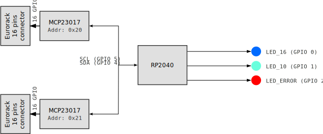

# eurorack-cable-tester-pico


## TOC

- [eurorack-cable-tester-pico](#eurorack-cable-tester-pico)
  - [TOC](#toc)
  - [About](#about)
  - [BOM](#bom)
  - [How to build](#how-to-build)
    - [Wiring/bloc diagram](#wiringbloc-diagram)
    - [Result](#result)
    - [Error message example](#error-message-example)
      - [Full open circuit](#full-open-circuit)
      - [Short circuit between pins 1,2 and 4](#short-circuit-between-pins-12-and-4)
  - [Credit](#credit)
  - [License](#license)

## About

This repo contains code and instruction to build a simple eurorack (both 10 pins and 16 pins) cable tester. The project is based on a RP2040 mcu and two GPIOs expander to be able to test all the possible connection.

As opposite to most tester that just test 12V, -12V, GND, ..., connections, my project test each pin individually for open or shortcut connection. It detects automatically if you have a 16 pins or 10 pins cable and in the case of error, you can open a terminal and have a full diagnostic printed in your favorite serial console.

## BOM

- 2x MCP23017 beakout board
  - For example [adafruit 5346](https://www.adafruit.com/product/5346)
- RP2040 board with GP0, GP1, GP2, GP4 and GP5 exposed.
  - Any board would work, in my case I took the small [Beetle RP2040 by dfrobot](https://www.dfrobot.com/product-2615.html).

## How to build

The project is based on micropython. Download and install the [latest micropython image](https://micropython.org/download/RPI_PICO/) on your rp2040 board.
Upload the two python file on the pico:

- [main.py](main.py)
- [mcp23017.py](mcp23017.py)

Refer to the following bloc diagram to assemble your tester board:

### Wiring/bloc diagram



Note: to connect the 10 pins connectors, I made a 10 to 16 pins adapter to fit on the far side of the 16 pins connector.


### Result

When booting, the onboard led of the Pico (GPIO13) lights up.

- If a 16 pins cable is plugged correctly, the led_16 (GPIO0) lights up
- If a 10 pins cable is plugged correctly, the led_10 (GPIO1) lights up
- If a 16 pins cable is plugged but has error, the led_16 (GPIO0) lights up and the led_error (GPIO2) lights up
- If a 10 pins cable is plugged but has error, the led_10 (GPIO1) lights up and the led_error (GPIO2) lights up
- If no cable is recognized the led_error (GPIO2) lights up

When the led_error (GPIO2) lights up, you can get debug status by opening a serial console.

### Error message example

#### Full open circuit

```
*-*-*-*-*-*-*-*-*-*-*-*-*-*-*-*-*-*-*-*-*-*-*-*-*-*-*-*-*-*-
short circuit pins number: 0
short circuit pins: []
open circuit pins number: 16
open circuit pins: [0, 1, 2, 3, 4, 5, 6, 7, 8, 9, 10, 11, 12, 13, 14, 15]
connected pins number: 0
open circuit pins number for 10 pins connector layout: 6
*-*-*-*-*-*-*-*-*-*-*-*-*-*-*-*-*-*-*-*-*-*-*-*-*-*-*-*-*-*-
```

#### Short circuit between pins 1,2 and 4

```
*-*-*-*-*-*-*-*-*-*-*-*-*-*-*-*-*-*-*-*-*-*-*-*-*-*-*-*-*-*-
short circuit pins: [[1, 2], [1, 4], [2, 4]]
*-*-*-*-*-*-*-*-*-*-*-*-*-*-*-*-*-*-*-*-*-*-*-*-*-*-*-*-*-*-
```

## Credit

[mcp23017.py](mcp23017.py) by Mike Cause  under MIT License - [GitHub Source](https://github.com/mcauser/micropython-mcp23017)

## License

[MIT License](LICENSE)

Copyright (c) 2025 Lucas Bonvin
